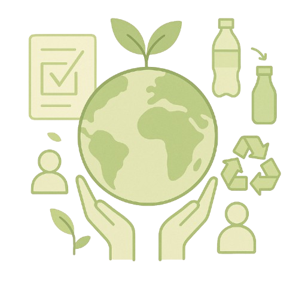

# YZTA-JAM: Sustainable Shopping Assistant



## 🌱 Project Overview

YZTA-JAM is a sustainable shopping assistant that helps users analyze their shopping lists and provides eco-friendly alternatives. The application uses AI to evaluate the environmental impact of shopping choices and suggests more sustainable options.

## ✨ Features

- **Shopping List Analysis**: Upload or manually enter your shopping list.
- **Image Recognition**: Upload images of shopping lists for automatic recognition.
- **Sustainability Scores**: Get detailed sustainability scores for each product.
- **Alternative Products**: Receive environmentally-friendly alternatives with detailed reasoning.
- **Visual Representation**: AI-generated images of sustainable alternatives.
- **Environmental Impact Information**: Learn about the environmental impact of your choices.
- **Information Trees**: Explore detailed information about products and sustainability topics.

## 🚀 Tech Stack

### Frontend
- Vue.js 3
- Vuex for state management
- Vue Router for navigation
- SCSS for styling
- Axios for API requests
- Vuelidate for form validation

### Backend
- Node.js with Express
- Google's Generative AI (Gemini) for text analysis
- Imagine SDK for image generation
- MongoDB for data storage
- Express File Upload for handling file uploads
- Langchain.js for AI integration

## 📋 Project Structure

```
yzta-jam/
├── frontend/               # Vue.js frontend
│   ├── src/
│   │   ├── assets/         # Static assets
│   │   ├── components/     # Reusable Vue components
│   │   ├── pages/          # Page components
│   │   ├── router/         # Vue Router configuration
│   │   ├── store/          # Vuex store
│   │   ├── api/            # API clients
│   │   ├── services/       # Service layer
│   │   └── utils/          # Utility functions
│   └── public/             # Public static files
├── backend/                # Node.js backend
│   ├── config/             # Configuration files
│   ├── controllers/        # Request handlers
│   ├── middleware/         # Express middleware
│   ├── models/             # Data models
│   ├── routes/             # API routes
│   ├── services/           # Business logic
│   └── utils/              # Utility functions
└── .env                    # Environment variables
```

## 🔧 Installation

### Prerequisites
- Node.js (v14 or higher)
- npm or yarn
- MongoDB

### Setting up the Backend
1. Navigate to the backend directory:
   ```bash
   cd backend
   ```
2. Install dependencies:
   ```bash
   npm install
   ```
3. Create a `config/config.env` file with the following variables:
   ```
   NODE_ENV=development
   PORT=5000
   MONGO_URI=your_mongodb_connection_string
   GEMINI_API_KEY=your_gemini_api_key
   IMAGINEART_API_KEY=your_imagineart_api_key
   APP_URL=http://localhost:8080
   ```
4. Start the development server:
   ```bash
   npm run dev
   ```

### Setting up the Frontend
1. Navigate to the frontend directory:
   ```bash
   cd frontend
   ```
2. Install dependencies:
   ```bash
   npm install
   ```
3. Create a `.env` file with:
   ```
   VUE_APP_API_URL=http://localhost:5000/api/v1
   ```
4. Start the development server:
   ```bash
   npm run serve
   ```

## 🌐 API Endpoints

### AI Analysis
- `POST /api/v1/ai/analyze-list`: Analyze a text shopping list or uploaded image
- `POST /api/v1/ai/create-information-tree`: Generate an information tree for a product

## 🔍 How It Works

1. **Upload your shopping list** - Either manually enter your shopping items or upload an image.
2. **AI Analysis** - The backend uses Gemini AI to analyze your list and generate sustainable alternatives.
3. **Visual Representation** - Sustainable alternatives are presented with AI-generated images.
4. **Information Trees** - Explore detailed information about products and sustainability topics.

## 🤝 Contributing

Contributions are welcome! Please feel free to submit a Pull Request.

1. Fork the repository
2. Create your feature branch (`git checkout -b feature/amazing-feature`)
3. Commit your changes (`git commit -m 'Add some amazing feature'`)
4. Push to the branch (`git push origin feature/amazing-feature`)
5. Open a Pull Request

## 📝 License

This project is licensed under the ISC License - see the LICENSE file for details.

## 📬 Contact

- Project Link: [https://github.com/yourusername/yzta-jam](https://github.com/yourusername/yzta-jam)

---

Made with ❤️ for a sustainable future 